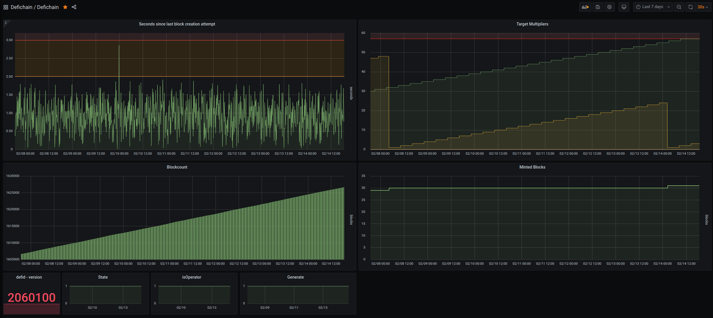

## defid-monitor.py

Defichain monitor script -> prometheus scraping -> grafana dashboard

Forked from https://gist.github.com/ageis/a0623ae6ec9cfc72e5cb6bde5754ab1f#file-bitcoind-monitor-py

This is a script written in Python intended to run alongside a Defichain node and export statistics for monitoring purposes.

It tracks metrics like: block height, last block creation attempt, minted blocks, multipliers.

These Defichain metrics are refreshed once every x seconds (configurable with variable POLL_INTERVAL).

### Screenshot



### How it works

[Prometheus](https://prometheus.io) is a monitoring system and time-series database.

It works by pulling or scraping numerical metrics from an HTTP endpoint (or "exporter"), and then ingesting and keeping track of them over time.

You can then build queries and alerting rules from this data. This code is targeted to users of both Prometheus and Defichain.

An exporter setup as a scrape target may be local or remote. Prometheus is a great backend for a visualization and analytics software such as [Grafana](https://grafana.com).

### Setup

Be sure to change path to your defi-cli binary inside defid-monitor.py (DEFICHAIN_CLI_PATH var)

```
# General vars
DEFICHAIN_CLI_PATH = '/home/defichain/.defi/bin/defi-cli'
```

Install dateutil and prometheus_client:
```
pip3 install python-dateutil prometheus_client
```

### Testing and requirements

To see it in action, run `python3 defid-monitor.py` and navigate to http://127.0.0.1:8334 in your browser.

Configure new target on your prometheus backend to fetch on http://your_public_ip:8334

Import the provided 'Grafana-Defichain-dashboard.json' file into your Grafana interface

### Running as a service

I'd also recommend running this persistently as a systemd service. For example:

```
[Unit]
Description=defid-monitor
After=network.target defid.service

[Service]
ExecStart=/usr/bin/python /home/defichain/.defi/bin/defid-monitor.py
KillMode=process
User=defichain
Group=defichain
Restart=on-failure

[Install]
WantedBy=multi-user.target
```

### TODO

- Look for defid in PATH, avoiding manual configuration
- Use the correct type of metrics: refer to https://prometheus.io/docs/concepts/metric_types/
- Get peerinfo (number of neighbors)
- Don't send values TM3 and TM4 when empty (unlocked nodes) ?
- Uptime
- Network stats
- Mempool stats
